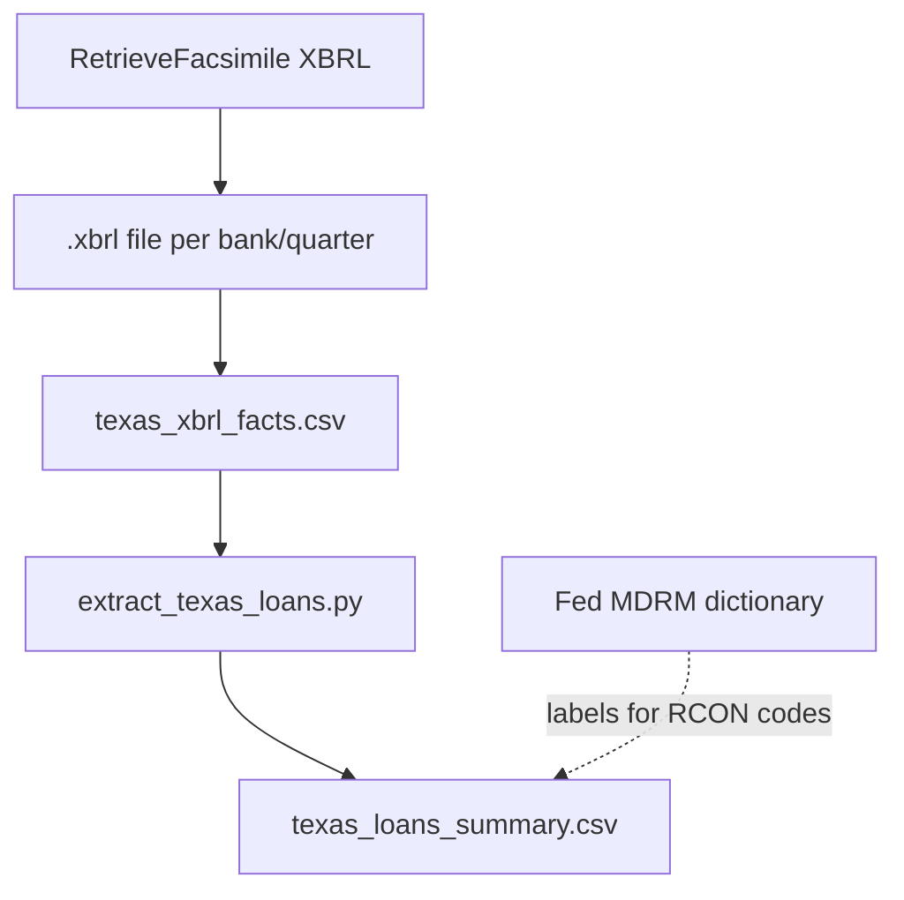

# How to get loan types from your Texas data

You already have the loan data in **`texas_xbrl_facts.csv`**. FFIEC does **not** use words like `"loan product"` in the file — they use **MDRM codes** such as `RCON2122`, `RCON1480`, `RCONF158`.

---

## Why filtering on `"loan"` fails

We scanned **2.19 million rows** in your file:

| Search | Result |
|--------|--------|
| Concept name contains `"loan"` | **0 rows** |
| Codes like `RCON…` / `RCFD…` / `RCONF…` | **~1.3 million rows** (loan schedules) |

So in Excel/Sheets, a filter `concept contains "loan"` returns **nothing**. That is normal.

---

## Terminology cheat sheet

| Term | Meaning |
|------|---------|
| **MDRM** | Micro Data Reference Manual — Fed dictionary of line codes |
| **RCON####** | Dollar amount for **domestic offices** (most large banks) |
| **RCFD####** | Same line, **consolidated / domestic** variant (often smaller banks, FFIEC 041) |
| **RCONF###** | **Schedule RC-C** (loans & leases) extension lines |
| **RCONHK### / RCONJ4###** | Extra RC-C detail / memoranda lines |
| **Schedule RC-C** | Call Report schedule for **loan & lease** categories |
| **context_ref** | XBRL period/scenario (which quarter / instant vs average) |
| **value_num** | Dollar amount (usually **thousands of dollars** on Call Report) |

**Lookup any code:** [Federal Reserve MDRM search](https://www.federalreserve.gov/apps/mdrm/data-dictionary) — paste `RCON2122`, etc.

**Schedule RC-C instructions (what categories mean):** [FDIC RC-C guide](https://www.fdic.gov/bank-financial-reports/031-041-rc-c1-loans-and-leases-december-2024)

---

## Loan “product types” → these MDRM codes

These are the main **loan category** lines (not individual customer loans):

| MDRM code | What it is (loan type / category) |
|-----------|-----------------------------------|
| **RCON2122** | **Total loans & leases** (headline total) |
| **RCON2145** | **Net loans & leases** (after allowance) |
| **RCON2130** | **Allowance for loan losses** |
| **RCONF158** | 1–4 family **residential construction** |
| **RCONF159** | Other **construction / land development** |
| **RCON1420** | Secured by **farmland** |
| **RCON1460** | **Multifamily** residential RE |
| **RCON1480** | **Commercial & industrial (C&I)** |
| **RCON1545** | **Credit card** plans |
| **RCON1583** | **Other consumer** loans |
| **RCON1590** | **Agricultural production** |
| **RCON1754** | **Lease financing** receivables |
| **RCON1797** | **HELOC / revolving** 1–4 family |
| **RCON5367** | 1–4 family **first lien** |
| **RCON5368** | 1–4 family **junior lien** |
| **RCON1403** | **1–4 family residential** mortgages |

Your file contains these codes (example counts across all TX banks × quarters):

- `RCON2122` — ~3,650 rows  
- `RCON1480`, `RCON1420`, `RCON1460`, etc. — similar coverage  
- `RCFD2122` — only ~58 rows (smaller / different form banks)

---

## Easiest path: run the extractor script (uses Federal Reserve MDRM)

Downloads the official [MDRM dictionary](https://www.federalreserve.gov/apps/mdrm/pdf/MDRM.zip) once to `data/mdrm/MDRM_CSV.csv`, then labels every row.

```bash
cd /Users/adityarajiv/Documents/ffiec-cdr
source .venv/bin/activate

# Smaller file: main loan totals & categories (~22k rows) — START HERE
python ONLY_TEXAS_SINCE_2025/extract_texas_loans.py --summary

# Full loan-related rows with MDRM names (~938k rows)
python ONLY_TEXAS_SINCE_2025/extract_texas_loans.py

# Dictionary only: all loan/lease MDRM codes + descriptions
python ONLY_TEXAS_SINCE_2025/extract_texas_loans.py --catalog
```

**Outputs:**

| File | Use in Google Sheets |
|------|----------------------|
| `exports/texas_loans_summary.csv` | **Start here** — main loan types with `item_name` from MDRM |
| `exports/texas_loans_labeled.csv` | All loan/RC-C rows with MDRM labels |
| `exports/texas_loan_products_mdrm_catalog.csv` | Code book: every loan-related MDRM line + definition |

Columns include **`mdrm_code`**, **`item_name`**, **`mdrm_description`**, **`mdrm_category`** from the Fed dictionary.

---

## Google Sheets (manual filter on raw facts)

If you use `texas_xbrl_facts.csv`:

1. Add a column `mdrm_code` = text after the last `}` in `concept`, or use Apps Script.
2. Filter **`mdrm_code`** with:

   - `RCON21` (totals & allowance)  
   - `RCON14` (real estate loans)  
   - `RCON15` (consumer / cards)  
   - `RCON16` (other loans)  
   - `RCONF1` (RC-C construction / categories)  
   - `RCON1480`, `RCON1545`, etc. (specific lines)

3. Use **`value_num`** for amounts; ignore rows where `value_num` is empty (text disclosures).

---

## Other useful information (not “loan product” but related)

| Topic | MDRM / where |
|-------|----------------|
| **Past due / nonaccrual** | `RCON5367`, `RCON5368`, `RCONF…` past-due lines; also RC-N schedule codes |
| **Total assets** (for ratios) | `RCON2170` / `RCON2385` |
| **Deposits** | `RCON2200` series |
| **Income** | `RIAD…` codes (separate schedule) |
| **Peer ratios** | **UBPR** (different API — not in current Texas extract) |

---

## What you cannot get from this file alone

| Expectation | Reality |
|-------------|---------|
| Individual loan contracts / borrower names | **Not in Call Report** (confidential) |
| Product names like “30-year fixed” | Only **aggregated balances by regulatory category** |
| Auto loan SKU list | Rolled into **consumer / other** lines |
| English label for every row | Download **FFIEC taxonomy** from [CDR taxonomy page](https://cdr.ffiec.gov/public/) for the quarter |

---

## Diagram: from API to loan categories



---

## Prefix families in your file (scan results)

| Prefix family | ~Rows | Typical content |
|---------------|-------|-----------------|
| RCONA5* | 51k | RC-C extension detail |
| RCONF1* | 34k | RC-C loan categories (construction, RE, etc.) |
| RCFD* | 34k | Smaller banks / domestic office lines |
| RCONHK* | 32k | RC-C memoranda |
| RCON21* | 23k | **Total loans, allowance, net loans** |
| RCONJ4* | 11k | RC-C extension |
| RCON14* | 9k | **Real estate secured loans** |
| RCON15* | 7k | **Consumer / credit card** |
| RCONLL* | 5k | **Leases** |
| RCON16* | 5k | **Other loans** |

---

*For questions on a single code, search `RCONxxxx` on the [MDRM site](https://www.federalreserve.gov/apps/mdrm/data-dictionary).*
