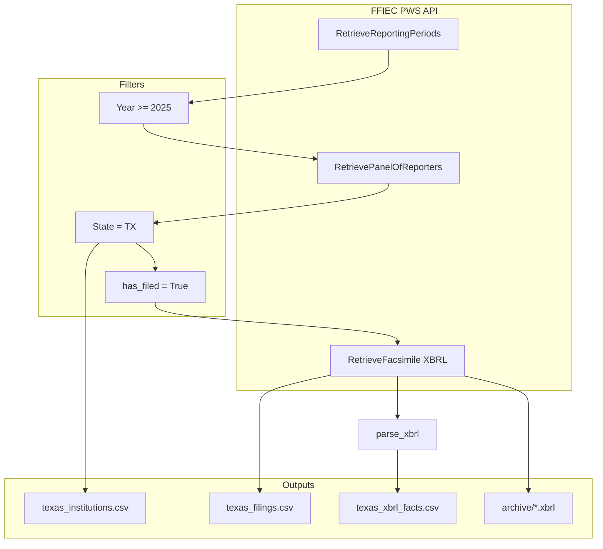
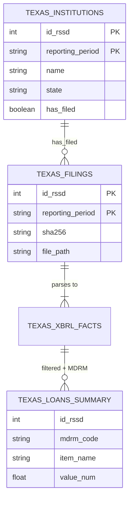
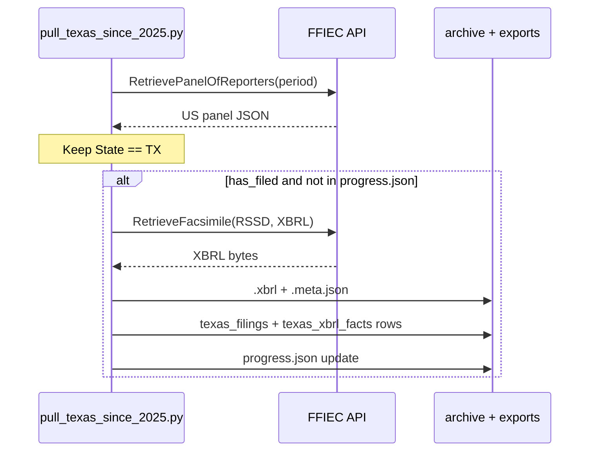

# ONLY_TEXAS_SINCE_2025 — Texas Call Reports (2025+)

**Project:** FFIEC regulatory data extract for **Texas banks only**  
**Data series:** Call Report (FFIEC 031 / 041)  
**Time range:** Reporting periods ending **2025 or later** (five quarters through Q1 2026)  
**Status:** **Complete** — 1,825 filings downloaded, parsed, and labeled with the Federal Reserve MDRM dictionary  

---

## Executive summary

This folder contains a **standalone pipeline** that:

1. Connects to the official [FFIEC Central Data Repository Public Web Service](https://cdr.ffiec.gov/public/) (REST API).
2. Filters institutions to **State = TX** on the Panel of Reporters.
3. Downloads **XBRL Call Report facsimiles** for every Texas bank that **filed** in each included quarter.
4. Parses XBRL into a fact table (`texas_xbrl_facts.csv`).
5. Enriches loan-related lines using the **[Federal Reserve MDRM](https://www.federalreserve.gov/apps/mdrm/)** (Micro Data Reference Manual) so codes like `RCON2122` have plain-English **loan product / category names**.

**No web scraping** — all data comes from FFIEC PWS APIs and the Fed MDRM reference file.

| Metric | Result |
|--------|--------|
| Reporting periods covered | **5** |
| Texas institutions (panel rows) | **1,825** (365 per quarter × 5) |
| XBRL filings downloaded | **1,825** (100% of `has_filed=True`) |
| Raw archive files | **1,825** `.xbrl` + metadata |
| Parsed XBRL fact rows | **2,186,590** |
| Loan summary rows (MDRM-labeled) | **31,396** |
| Full loan/RC-C rows (MDRM-labeled) | **937,816** |
| MDRM loan product definitions (catalog) | **24,015** codes |

---

## Teammates: where to get the data

### SharePoint (recommended for non-technical users)

**[Texas FFIEC CSV files — SharePoint folder](https://cedarframe-my.sharepoint.com/:f:/g/personal/aditya_alldunkin_com/IgCVLkzsCMRsQqXAsv7Ql-A5AW2lhgQIsUy0pHp0Kv9Vkm4?e=jGFMZX)**

Upload or download these files from that folder. GitHub does **not** store the large CSVs (see `.gitignore`).

### Local path (after running the pipeline)

```
/Users/adityarajiv/Documents/ffiec-cdr/ONLY_TEXAS_SINCE_2025/exports/
```

---

## Table of contents

1. [Extraction results by quarter](#extraction-results-by-quarter)
2. [All output files](#all-output-files)
3. [Which FFIEC APIs were used](#which-ffiec-apis-were-used)
4. [How extraction works (step-by-step)](#how-extraction-works-step-by-step)
5. [Loan types and MDRM labeling](#loan-types-and-mdrm-labeling)
6. [Project layout](#project-layout)
7. [Scripts reference](#scripts-reference)
8. [Architecture diagrams](#architecture-diagrams)
9. [Setup and credentials](#setup-and-credentials)
10. [Resume, rebuild, and troubleshooting](#resume-rebuild-and-troubleshooting)
11. [Google Sheets and analysis tips](#google-sheets-and-analysis-tips)
12. [Limitations and what this data is not](#limitations-and-what-this-data-is-not)
13. [Related documentation](#related-documentation)
14. [References](#references)

---

## Extraction results by quarter

Every Texas institution on the FFIEC panel with **`HasFiledForReportingPeriod = True`** received a download for that quarter.

| Reporting period | Quarter | TX banks on panel | XBRL files downloaded | Archive folder |
|------------------|---------|-------------------|------------------------|----------------|
| `3/31/2025` | Q1 2025 | 377 | 377 | `archive/call/3-31-2025/` |
| `6/30/2025` | Q2 2025 | 372 | 372 | `archive/call/6-30-2025/` |
| `9/30/2025` | Q3 2025 | 364 | 364 | `archive/call/9-30-2025/` |
| `12/31/2025` | Q4 2025 | 360 | 360 | `archive/call/12-31-2025/` |
| `3/31/2026` | Q1 2026 | 352 | 352 | `archive/call/3-31-2026/` |
| **Total** | | **1,825** | **1,825** | |

**Checkpoint file:** `data/progress.json` lists **1,825** completed `period|RSSD` pairs — matches archive and filings counts.

**Institutions per quarter:** ~352–377 (Texas panel size varies slightly each quarter).

---

## All output files

### Core extract (from FFIEC API)

| File | Rows | Size | Description |
|------|------|------|-------------|
| [`exports/texas_institutions.csv`](exports/texas_institutions.csv) | 1,825 | ~0.1 MB | Every TX bank on Panel of Reporters per quarter: name, city, RSSD, filing type, `has_filed` |
| [`exports/texas_filings.csv`](exports/texas_filings.csv) | 1,825 | ~0.4 MB | One row per downloaded XBRL: path, SHA-256, retrieval time, period |
| [`exports/texas_xbrl_facts.csv`](exports/texas_xbrl_facts.csv) | 2,186,590 | ~208 MB | All parsed XBRL facts (every line item in filings) |
| [`archive/call/<period>/<rssd>.xbrl`](archive/call/) | 1,825 files | varies | Raw regulatory filings (source of truth) |
| `archive/call/<period>/<rssd>.xbrl.meta.json` | 1,825 | small | Provenance: SHA-256, timestamp |

**Zip for SharePoint:** `texas_csv_exports_2025_plus.zip` (~12 MB compressed) — institutions + filings + facts.

### Loan / RC-C exports (MDRM-labeled)

Generated by `extract_texas_loans.py` using the Federal Reserve `MDRM_CSV.csv` dictionary.

| File | Rows | Size | Best for |
|------|------|------|----------|
| [`exports/texas_loans_summary.csv`](exports/texas_loans_summary.csv) | 31,396 | ~30 MB | **Google Sheets — start here** (main loan categories per bank/quarter) |
| [`exports/texas_loans_labeled.csv`](exports/texas_loans_labeled.csv) | 937,816 | ~805 MB | Full Schedule RC-C / loan-related detail with Fed labels |
| [`exports/texas_loan_products_mdrm_catalog.csv`](exports/texas_loan_products_mdrm_catalog.csv) | 24,015 | ~13 MB | Code book: MDRM definitions for loan/lease lines |

### Joined tables + Lenni EDA (for sales / Texas Community Bank Index)

Run `python build_lenni_eda_report.py` to join all CSVs and generate an exhaustive PDF report aligned with Lenni ICP ($500M–$2B Texas community banks).

| File | Rows | Description |
|------|------|-------------|
| [`exports/texas_master_joined.csv`](exports/texas_master_joined.csv) | 1,825 | **Master table:** institution + filing + wide loan/balance-sheet metrics per bank-quarter |
| [`exports/texas_bank_profiles_latest.csv`](exports/texas_bank_profiles_latest.csv) | 360 | Latest quarter snapshot per bank with `icp_fit` flag |
| [`exports/texas_loans_joined_long.csv`](exports/texas_loans_joined_long.csv) | 31,396 | Long loan lines + institution fields (city, ICP fit, assets) |
| [`analysis/Lenni_Texas_Bank_EDA_Report.pdf`](analysis/Lenni_Texas_Bank_EDA_Report.pdf) | — | **25-chart EDA report** + narrative (Lenni context) |
| `analysis/lenni_icp_prospect_list.csv` | 105 | CLO prospect list — banks in $500M–$2B band (latest) |
| `analysis/lenni_market_segments.csv` | — | TAM segments by asset size |

**Join keys:** `id_rssd` + `reporting_period`  
**Lenni ICP filter:** `icp_fit == "ICP ($500M–$2B)"` on latest profiles (105 banks in Q1 2026 extract).

### Key columns in MDRM-labeled loan files

| Column | Meaning |
|--------|---------|
| `id_rssd` | Federal Reserve RSSD ID (join key) |
| `institution_name` | Bank name |
| `reporting_period` | Quarter end (`MM/DD/YYYY`) |
| `mdrm_code` | FFIEC line code (e.g. `RCON2122`, `RCON1480`) |
| `item_name` | **Official Fed short name** (e.g. `TOTAL LOANS AND LEASES; NET OF UNEARNED INCOME`) |
| `mdrm_description` | Full Federal Reserve definition (up to 800 characters) |
| `mdrm_category` | `loan_or_lease`, `schedule_rc_c`, or `loan_related_prefix` |
| `reporting_form` | e.g. `FFIEC 031`, `FFIEC 041` |
| `item_type` | `F` = financial line item |
| `value_num` | Numeric amount (Call Report dollars are typically in **thousands**) |
| `context_ref` | XBRL period/scenario |
| `unit_ref` | Usually `USD` |

---

## Which FFIEC APIs were used

FFIEC exposes **7** Public Web Service methods. This Texas extract uses **3** — the minimum set for a **complete Call Report XBRL pull**:

| # | API method | Used? | Role in this project |
|---|------------|-------|----------------------|
| 1 | `RetrieveReportingPeriods` | **Yes** | List Call Report quarters; filter year ≥ 2025 |
| 2 | `RetrievePanelOfReporters` | **Yes** | All banks expected to file; filter `State == TX` |
| 3 | `RetrieveFacsimile` | **Yes** | Download **XBRL** facsimile per bank/quarter |
| 4 | `RetrieveFilersSinceDate` | No | Incremental sync only (not needed for full backfill) |
| 5 | `RetrieveFilersSubmissionDateTime` | No | Optional submission timestamps |
| 6 | `RetrieveUBPRReportingPeriods` | No | **UBPR** is a different report (peer ratios) |
| 7 | `RetrieveUBPRXBRLFacsimile` | No | UBPR XBRL — not Call Report |

**Formats not downloaded:** PDF and SDF (same API #3 with different `facsimileFormat` header).

**API base URL:** `https://ffieccdr.azure-api.us/public/`  
**Spec:** [CDR-PDD-SIS-611 PDF](https://cdr.ffiec.gov/public/Files/SIS611_-_Retrieve_Public_Data_via_Web_Service.pdf)

---

## How extraction works (step-by-step)

### Phase A — Download (`pull_texas_since_2025.py`)



| Step | Action | Detail |
|------|--------|--------|
| 0 | Authenticate | Headers `UserID` + `Authentication: Bearer <token>` from `../.env` |
| 1 | List periods | `RetrieveReportingPeriods` → keep periods with year ≥ 2025 |
| 2 | Panel per period | `RetrievePanelOfReporters` → filter `State.upper() == "TX"` |
| 3 | Write institutions | All TX panel rows → `texas_institutions.csv` |
| 4 | Download filings | For each bank with `HasFiledForReportingPeriod`, call `RetrieveFacsimile` (XBRL) |
| 5 | Archive | Save raw bytes to `archive/call/<period>/<rssd>.xbrl` + `.meta.json` |
| 6 | Parse | `ffiec_cdr.parser.parse_xbrl` → append `texas_xbrl_facts.csv` |
| 7 | Resume | `data/progress.json` stores `period\|rssd` — skips completed pairs on re-run |
| 8 | Rate limit | ~1.5 seconds between API calls (~2,400/hour, under FFIEC 2,500 cap) |

**Runtime:** ~1–3 hours for full Texas 2025+ pull (depends on network; laptop must stay awake).

### Phase B — MDRM labeling (`extract_texas_loans.py`)

| Step | Action | Detail |
|------|--------|--------|
| 1 | Download MDRM | [MDRM.zip](https://www.federalreserve.gov/apps/mdrm/pdf/MDRM.zip) → `data/mdrm/MDRM_CSV.csv` (~91 MB) |
| 2 | Build lookup | Map `RCON2122` → item name + description + reporting form |
| 3 | Filter facts | Keep loan/RC-C related rows from `texas_xbrl_facts.csv` |
| 4 | Export | Write `texas_loans_summary.csv`, `texas_loans_labeled.csv`, `texas_loan_products_mdrm_catalog.csv` |

### Phase C — Rebuild CSVs from archive (if needed)

If `texas_filings.csv` or facts look incomplete after a **restart**, the archive is still complete:

```bash
python rebuild_csv_from_archive.py
python extract_texas_loans.py --summary
```

---

## Loan types and MDRM labeling

### Important: FFIEC does not use the word "loan" in XBRL tags

Filtering `concept contains "loan"` in `texas_xbrl_facts.csv` returns **zero rows**. Loan data uses **MDRM codes**:

| Code | Official MDRM name (loan category) |
|------|-----------------------------------|
| `RCON2122` | Total loans and leases |
| `RCON2145` | Net loans and leases (after allowance) |
| `RCON2130` | Allowance for loan and lease losses |
| `RCON1480` | Commercial / nonfarm nonresidential RE loans |
| `RCON1420` | Real estate loans secured by farmland |
| `RCON1460` | Multifamily residential RE loans |
| `RCON1545` | Credit card plans |
| `RCON1583` | Other consumer loans |
| `RCON1590` | Agricultural production loans |
| `RCON1754` | Lease financing receivables |
| `RCONF158` / `RCONF159` | Construction / land development (Schedule RC-C) |

**Prefix guide:**

- `RCON14*` — real estate–secured loans  
- `RCON15*` — consumer / credit card  
- `RCON16*` — other loans  
- `RCON21*` — totals and allowance  
- `RCONF1*`, `RCONHK*`, `RCONJ4*` — Schedule RC-C detail lines  

**Lookup any code:** [Federal Reserve MDRM search](https://www.federalreserve.gov/apps/mdrm/data-dictionary)

**Schedule RC-C instructions:** [FDIC RC-C guide](https://www.fdic.gov/bank-financial-reports/031-041-rc-c1-loans-and-leases-december-2024)

### What you get vs. what you do not

| You get | You do not get |
|---------|----------------|
| Aggregated balances by **regulatory loan category** per bank per quarter | Individual loan contracts or borrower names |
| Official Fed **product/category** names via MDRM | Marketing names (“30-year fixed”, etc.) |
| Past due / allowance lines when present in XBRL | Real-time loan-level servicing data |

See **[LOAN_EXTRACTION_GUIDE.md](./LOAN_EXTRACTION_GUIDE.md)** for analyst workflows.

---

## Project layout

```
ONLY_TEXAS_SINCE_2025/
├── README.md                           ← This file
├── DATA_DICTIONARY.md                  ← Column definitions for all CSVs
├── LOAN_EXTRACTION_GUIDE.md            ← How to analyze loan data
├── UPLOAD_TO_SHAREPOINT.md             ← Maintainer upload steps
│
├── pull_texas_since_2025.py            ← Main FFIEC download + parse
├── extract_texas_loans.py              ← MDRM-labeled loan exports
├── rebuild_csv_from_archive.py         ← Rebuild core CSVs from archive
├── mdrm_loader.py                      ← Load Fed MDRM_CSV.csv
│
├── scripts/
│   └── download_mdrm.py              ← One-time MDRM download
│
├── exports/                            ← CSV outputs (SharePoint copies)
│   ├── texas_institutions.csv
│   ├── texas_filings.csv
│   ├── texas_xbrl_facts.csv
│   ├── texas_loans_summary.csv         ← START HERE for loans
│   ├── texas_loans_labeled.csv
│   └── texas_loan_products_mdrm_catalog.csv
│
├── archive/call/                       ← Raw XBRL (1,825 files)
│   ├── 3-31-2025/
│   ├── 6-30-2025/
│   ├── 9-30-2025/
│   ├── 12-31-2025/
│   └── 3-31-2026/
│
└── data/
    ├── progress.json                   ← Resume state (1,825 completed)
    ├── pull.log                        ← Download log
    └── mdrm/
        ├── MDRM.zip                      ← Downloaded from Fed (gitignored)
        └── MDRM_CSV.csv                  ← 75k+ MDRM definitions (gitignored)
```

---

## Scripts reference

| Script | Command | Purpose |
|--------|---------|---------|
| Main extract | `python pull_texas_since_2025.py` | Full Texas 2025+ download |
| Test extract | `python pull_texas_since_2025.py --max 5` | Download only 5 filings |
| PDF format | `python pull_texas_since_2025.py --format PDF` | PDF instead of XBRL (no facts parse) |
| Rebuild CSVs | `python rebuild_csv_from_archive.py` | Regenerate filings/facts from archive |
| Download MDRM | `python scripts/download_mdrm.py` | Fetch Fed MDRM dictionary |
| Loan summary | `python extract_texas_loans.py --summary` | **~31k rows** — main loan categories |
| Loan full | `python extract_texas_loans.py` | **~938k rows** — all loan/RC-C lines |
| MDRM catalog | `python extract_texas_loans.py --catalog` | Code book only |
| **Joined EDA + PDF** | `python build_lenni_eda_report.py` | Join all CSVs, 25-slice EDA, Lenni PDF report |

All scripts run from repo root with venv activated:

```bash
cd /Users/adityarajiv/Documents/ffiec-cdr
source .venv/bin/activate
python ONLY_TEXAS_SINCE_2025/<script>.py
```

Credentials: `../.env` with `FFIEC_USER_ID` and `FFIEC_TOKEN`.

---

## Architecture diagrams

### Data model (how tables join)



### Sequence: one bank, one quarter



---

## Setup and credentials

### Requirements

| Item | Detail |
|------|--------|
| Python | 3.9+ with parent venv (`../requirements.txt`) |
| FFIEC PWS account | [CDR public site](https://cdr.ffiec.gov/public/) → Manage My Web Service Account |
| `.env` | `FFIEC_USER_ID`, `FFIEC_TOKEN` in `ffiec-cdr/.env` |
| Disk space | ~2 GB (archive + CSVs + MDRM) |
| Network | Stable; Mac awake during download |

### First-time setup

```bash
cd /Users/adityarajiv/Documents/ffiec-cdr
python3 -m venv .venv
source .venv/bin/activate
pip install -r requirements.txt
cp .env.example .env   # add FFIEC credentials
```

### Full pipeline (from scratch)

```bash
# 1. Download Texas Call Reports
python ONLY_TEXAS_SINCE_2025/pull_texas_since_2025.py

# 2. Rebuild core CSVs if needed (after interrupted run)
python ONLY_TEXAS_SINCE_2025/rebuild_csv_from_archive.py

# 3. MDRM loan exports
python ONLY_TEXAS_SINCE_2025/scripts/download_mdrm.py   # once
python ONLY_TEXAS_SINCE_2025/extract_texas_loans.py --summary
python ONLY_TEXAS_SINCE_2025/extract_texas_loans.py      # optional full loan file

# 4. Upload exports/ to SharePoint for teammates
```

Keep Mac awake:

```bash
caffeinate -dims
```

---

## Resume, rebuild, and troubleshooting

| Issue | Solution |
|-------|----------|
| Laptop slept mid-download | Re-run `pull_texas_since_2025.py` — skips completed entries in `progress.json` |
| `texas_filings.csv` incomplete but archive full | Run `rebuild_csv_from_archive.py` |
| Filter "loan" returns nothing | Use `texas_loans_summary.csv` (MDRM labels), not raw facts |
| HTTP 403 from API | Custom `User-Agent` required (handled in parent `FFIECClient`) |
| Token expired | Renew at FFIEC PWS account (every 90 days) |
| CSVs not on GitHub | By design — use SharePoint link above |

**Verify completeness:**

```bash
# Should show 1825 for each period
ls ONLY_TEXAS_SINCE_2025/archive/call/*/  | wc -l
python -c "import json; print(len(json.load(open('ONLY_TEXAS_SINCE_2025/data/progress.json'))['completed']))"
```

---

## Google Sheets and analysis tips

### Recommended import order

1. **`texas_loans_summary.csv`** — loan categories with readable `item_name`  
2. **`texas_institutions.csv`** — bank names and cities  
3. **`texas_filings.csv`** — filing inventory  
4. **`texas_loan_products_mdrm_catalog.csv`** — look up any `mdrm_code`  
5. **`texas_xbrl_facts.csv`** or **`texas_loans_labeled.csv`** — only if you need full detail (very large)

### Example analyses

| Question | How |
|----------|-----|
| Total loans per bank | Filter `mdrm_code = RCON2122`, pivot by `institution_name` |
| C&I exposure | Filter `mdrm_code = RCON1480` |
| Credit cards | Filter `mdrm_code = RCON1545` |
| Quarter-over-quarter | Same `id_rssd`, compare `reporting_period` |
| Loan-to-assets | Join `RCON2122` / `RCON2170` (assets) on same bank/period |

**Amounts:** Confirm units in MDRM (typically **thousands of dollars** for dollar lines).

---

## Limitations and what this data is not

| Topic | Note |
|-------|------|
| Geography | **Texas only** (`State = TX` on panel) |
| Time | **2025+ quarters only** (not full history) |
| Report type | **Call Report** only (not UBPR, not Y-9C) |
| Format | **XBRL** only in this extract (not PDF/SDF) |
| Loan granularity | **Regulatory categories**, not individual loans |
| GitHub | Code + docs only; **data on SharePoint** |
| FFIEC rate limit | ~2,500 API calls/hour — script uses 1.5s delay |

---

## Related documentation

| Document | Contents |
|----------|----------|
| [DATA_DICTIONARY.md](./DATA_DICTIONARY.md) | Every column in every CSV |
| [LOAN_EXTRACTION_GUIDE.md](./LOAN_EXTRACTION_GUIDE.md) | Loan analysis for non-technical users |
| [UPLOAD_TO_SHAREPOINT.md](./UPLOAD_TO_SHAREPOINT.md) | How to refresh SharePoint files |
| [../README.md](../README.md) | Parent `ffiec-cdr` platform (national scope) |

---

## References

- [FFIEC CDR Public site](https://cdr.ffiec.gov/public/)
- [PWS help](https://cdr.ffiec.gov/public/HelpFiles/PWSInfo.htm)
- [SIS611 API specification (PDF)](https://cdr.ffiec.gov/public/Files/SIS611_-_Retrieve_Public_Data_via_Web_Service.pdf)
- [Federal Reserve MDRM](https://www.federalreserve.gov/apps/mdrm/)
- [MDRM download (CSV zip)](https://www.federalreserve.gov/apps/mdrm/pdf/MDRM.zip)
- [Manage Facsimiles (manual UI)](https://cdr.ffiec.gov/public/ManageFacsimiles.aspx)
- [FDIC Schedule RC-C instructions](https://www.fdic.gov/bank-financial-reports/031-041-rc-c1-loans-and-leases-december-2024)

---

## Changelog (project milestones)

| Date | Milestone |
|------|-----------|
| 2026-06-02 | Initial Texas extract script; first XBRL downloads |
| 2026-06-02–03 | Full backfill: **1,825** filings across 5 quarters |
| 2026-06-03 | `rebuild_csv_from_archive.py`; CSVs aligned with archive |
| 2026-06-03 | Federal Reserve **MDRM** integration; loan-labeled exports |
| 2026-06-03 | SharePoint distribution link added for teammates |

---

*Maintainer: PayPro LLC / FFIEC_DATABASE_PROJECT. For API token issues, use the email on your FFIEC PWS account.*
