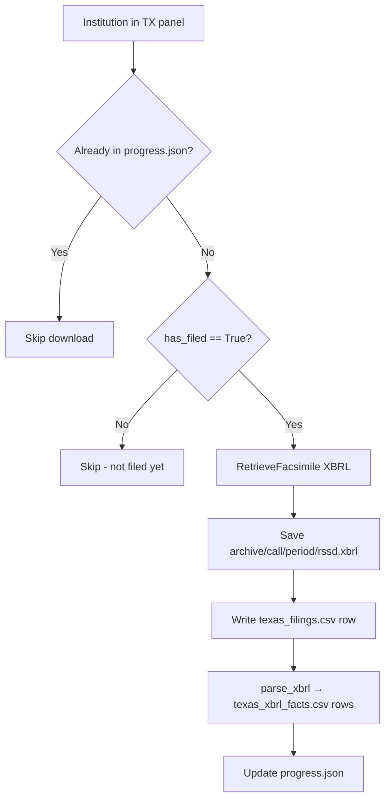
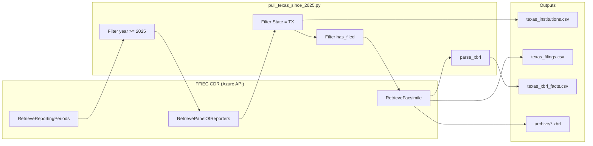
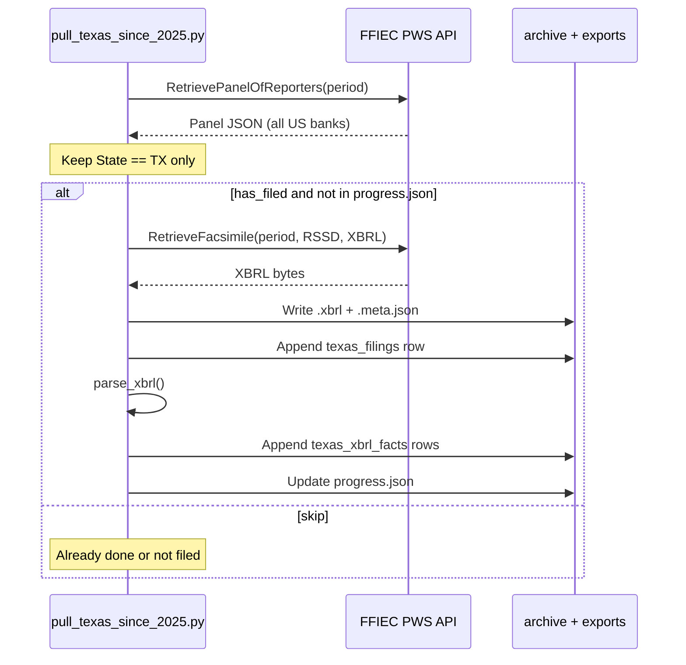
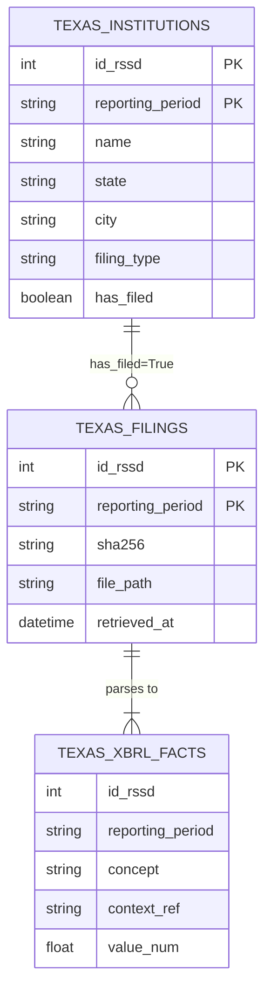

# ONLY_TEXAS_SINCE_2025 — Texas Call Reports (2025+)

A **standalone extract** of FFIEC **Call Report** data for **Texas (`TX`)** institutions only, for reporting periods ending in **2025 or later** (five quarters through `3/31/2026`).

Outputs are three **CSV files** for Google Sheets / Excel, plus raw **XBRL** archives.

**Full column documentation:** see [DATA_DICTIONARY.md](./DATA_DICTIONARY.md).

---

## Table of contents

1. [What this folder contains](#what-this-folder-contains)
2. [How data is extracted (detailed)](#how-data-is-extracted-detailed)
3. [Architecture diagrams](#architecture-diagrams)
4. [Quick start](#quick-start)
5. [Output files](#output-files)
6. [Resume, sleep, and CSV rebuild](#resume-sleep-and-csv-rebuild)
7. [Google Sheets](#google-sheets)
8. [Relationship to main project](#relationship-to-main-project)

---

## What this folder contains

```
ONLY_TEXAS_SINCE_2025/
├── README.md                      ← This file
├── DATA_DICTIONARY.md             ← Detailed CSV column definitions
├── pull_texas_since_2025.py       ← Main extraction script
├── rebuild_csv_from_archive.py    ← Rebuild CSVs from archive (if needed)
├── exports/
│   ├── texas_institutions.csv     ← Panel: all TX banks per quarter
│   ├── texas_filings.csv          ← One row per downloaded XBRL
│   └── texas_xbrl_facts.csv       ← Parsed line items (large)
├── archive/call/<period>/         ← Raw .xbrl + .meta.json
└── data/
    ├── progress.json              ← Resume checkpoints
    └── pull.log                   ← Run log
```

**Typical completed run (approximate):**

| Asset | Scale |
|-------|--------|
| Reporting periods | 5 (`3/31/2025` … `3/31/2026`) |
| Archived XBRL files | ~3,600 |
| `texas_institutions.csv` rows | ~1,825 |
| `texas_xbrl_facts.csv` rows | ~1.2M |

---

## How data is extracted (detailed)

This section explains **exactly** how `pull_texas_since_2025.py` builds the dataset. No web scraping is used — only the official **FFIEC Public Web Service (REST API)**.

### Step 0 — Prerequisites

| Requirement | Detail |
|-------------|--------|
| **Account** | FFIEC CDR [PWS account](https://cdr.ffiec.gov/public/) (Manage My Web Service Account) |
| **Credentials** | `FFIEC_USER_ID` and `FFIEC_TOKEN` in parent folder `../.env` |
| **Python** | Parent venv: `requests`, `lxml`, `python-dotenv` (see `../requirements.txt`) |
| **Network** | Stable connection; Mac should stay awake (~1–3 hours for full TX pull) |

The script imports `FFIECClient` and `parse_xbrl` from the parent package `ffiec_cdr` (`../src/ffiec_cdr/`).

---

### Step 1 — Authenticate to FFIEC

Every HTTP request sends two headers (per [SIS611 spec](https://cdr.ffiec.gov/public/Files/SIS611_-_Retrieve_Public_Data_via_Web_Service.pdf)):

| Header | Value |
|--------|--------|
| `UserID` | Your PWS username |
| `Authentication` | `Bearer <token>` |

Base URL: `https://ffieccdr.azure-api.us/public/`

The client also sets `User-Agent: FFIEC-CDR-Client/1.0` (required — default `python-requests` may get HTTP 403).

---

### Step 2 — Discover reporting periods (2025+)

**API:** `GET RetrieveReportingPeriods`  
**Header:** `dataSeries: Call`

Returns a JSON array of quarter-end dates, newest first, e.g. `["3/31/2026", "12/31/2025", ...]`.

**Filter in script:**

```python
MIN_YEAR = 2025
# Keep periods where year part of MM/DD/YYYY >= 2025
```

Result for a typical run: **5 periods**

- `3/31/2026`, `12/31/2025`, `9/30/2025`, `6/30/2025`, `3/31/2025`

---

### Step 3 — For each period: get Texas panel

**API:** `GET RetrievePanelOfReporters`  
**Headers:** `dataSeries: Call`, `reportingPeriodEndDate: <period>`

Returns one JSON object per institution expected to file, including:

| API field | CSV column (`texas_institutions`) |
|-----------|----------------------------------|
| `ID_RSSD` | `id_rssd` |
| `Name` | `name` |
| `State` | `state` |
| `City` | `city` |
| `FilingType` | `filing_type` |
| `HasFiledForReportingPeriod` | `has_filed` |

**Geographic filter (script):**

```python
texas = [r for r in panel if (r.get("State") or "").upper() == "TX"]
```

Only institutions with **`State == "TX"`** are kept (~352–372 per quarter).

Each Texas panel row is written to **`texas_institutions.csv`** (one row per bank × quarter).

---

### Step 4 — Skip or download each filing

For each Texas institution in the panel:



**Resume:** `data/progress.json` stores `"completed": ["3/31/2025|623052", ...]`. Re-running the script **does not re-download** completed pairs.

**API:** `GET RetrieveFacsimile`  
**Headers:**

| Header | Example |
|--------|---------|
| `dataSeries` | `Call` |
| `reportingPeriodEndDate` | `6/30/2025` |
| `fiIdType` | `ID_RSSD` |
| `fiId` | `623052` |
| `facsimileFormat` | `XBRL` (default) |

**Response:** JSON with base64 or byte array → decoded to raw **XBRL XML**.

**Rate limiting:** ~**1.5 seconds** between API calls (FFIEC ~2,500 downloads/hour cap).

---

### Step 5 — Archive raw file + metadata

For each download:

| File | Purpose |
|------|---------|
| `archive/call/6-30-2025/623052.xbrl` | Exact bytes from FFIEC |
| `archive/call/6-30-2025/623052.xbrl.meta.json` | `id_rssd`, `period`, `sha256`, `retrieved_at` |

**Integrity:** SHA-256 hash stored in metadata and `texas_filings.sha256`.

---

### Step 6 — Parse XBRL into facts

**Module:** `ffiec_cdr.parser.parse_xbrl`

1. Load XML with `lxml` (recover mode for large files).
2. Iterate all elements in the document.
3. Skip structural tags (`context`, `unit`, `schemaRef`, …).
4. For elements with text values, capture:
   - `concept` (tag name or full QName)
   - `contextRef` / `unitRef` attributes
   - `value_text` (string, max 2,000 chars)
   - `value_num` (parsed float if numeric)
5. Deduplicate within filing; cap at 50,000 facts per file.

Each fact → one row in **`texas_xbrl_facts.csv`**.

---

### Step 7 — Logging and progress

| Log | Content |
|-----|---------|
| Terminal + `data/pull.log` | Every 10 downloads: `Downloaded N filings, M fact rows` |
| `data/progress.json` | Completed `period\|rssd` keys after each success |

---

### End-to-end pipeline (system view)



---

### Sequence diagram (one bank, one quarter)



---

## Architecture diagrams

### Data model (how CSVs relate)



### Folder layout after extraction

```text
ONLY_TEXAS_SINCE_2025/
├── exports/                    ← Upload these to Google Sheets
│   ├── texas_institutions.csv
│   ├── texas_filings.csv
│   └── texas_xbrl_facts.csv    ← Very large
└── archive/call/
    ├── 3-31-2025/
    │   ├── 623052.xbrl
    │   └── 623052.xbrl.meta.json
    ├── 6-30-2025/
    ├── 9-30-2025/
    ├── 12-31-2025/
    └── 3-31-2026/
```

---

## Quick start

```bash
cd /Users/adityarajiv/Documents/ffiec-cdr
source .venv/bin/activate

# Full Texas 2025+ extract
python ONLY_TEXAS_SINCE_2025/pull_texas_since_2025.py

# Test (5 downloads)
python ONLY_TEXAS_SINCE_2025/pull_texas_since_2025.py --max 5

# PDF instead of XBRL (no texas_xbrl_facts rows)
python ONLY_TEXAS_SINCE_2025/pull_texas_since_2025.py --format PDF
```

Keep Mac awake:

```bash
caffeinate -dims   # second terminal tab
```

---

## Output files

| File | Description |
|------|-------------|
| [DATA_DICTIONARY.md](./DATA_DICTIONARY.md) | **Column-level documentation** for all three CSVs |
| `exports/texas_institutions.csv` | Texas panel universe per quarter |
| `exports/texas_filings.csv` | Downloaded filings manifest |
| `exports/texas_xbrl_facts.csv` | Parsed XBRL facts (line items) |

---

## Resume, sleep, and CSV rebuild

### If the laptop sleeps

The download **pauses**. Wake the Mac and re-run:

```bash
python ONLY_TEXAS_SINCE_2025/pull_texas_since_2025.py
```

Completed banks are **skipped** via `progress.json`.

### If CSVs look incomplete

Restarting the script **rewrites** CSV files but **skips** re-downloads — so `texas_filings.csv` / `texas_xbrl_facts.csv` may only list the **last session’s** new downloads while **`archive/`** has everything.

**Fix:** rebuild from archive:

```bash
python ONLY_TEXAS_SINCE_2025/rebuild_csv_from_archive.py
```

This reparses all `.xbrl` files under `archive/call/` into complete CSVs.

---

## Google Sheets

1. Run `rebuild_csv_from_archive.py` if you want the fullest CSVs.
2. Upload to Google Drive:
   - Start with **`texas_filings.csv`** (overview).
   - Use **`texas_institutions.csv`** for bank lists.
   - **`texas_xbrl_facts.csv`** is huge — filter one quarter or one bank first, or use BigQuery / SQLite instead of one sheet.

---

## Relationship to main project

| Item | Location |
|------|----------|
| Shared API client | `../src/ffiec_cdr/client.py` |
| Credentials | `../.env` |
| National backfill | `../scripts/backfill_all.py` |
| National exports | `../exports/` |

This folder is **independent** — national and Texas extracts do not share `archive/` or CSV paths.

---

## References

- [FFIEC CDR Public site](https://cdr.ffiec.gov/public/)
- [PWS help](https://cdr.ffiec.gov/public/HelpFiles/PWSInfo.htm)
- [SIS611 API PDF](https://cdr.ffiec.gov/public/Files/SIS611_-_Retrieve_Public_Data_via_Web_Service.pdf)
- [Manage Facsimiles (manual UI)](https://cdr.ffiec.gov/public/ManageFacsimiles.aspx)
