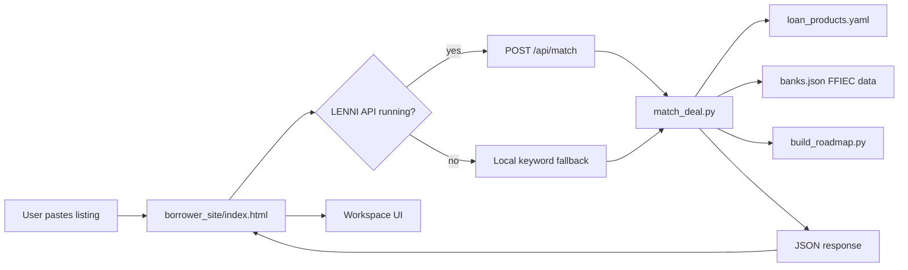

# Lenni Deal Matcher — Implementation Log

**Date:** 2026-06-22  
**Project:** `/Users/adityarajiv/Documents/ffiec-cdr`  
**Reference UI:** `lenni-index-updated (1).html` (borrower hero + workspace)  
**Live site target:** http://lenni-borrower.s3-website.us-east-2.amazonaws.com/

---

## Executive summary

Built an end-to-end **listing → loan product → bank recommendation** system for the Lenni borrower site:

1. **Backend model** (`match_deal.py`) — parses listing text, maps to loan sub-types from `loan_products.yaml`, ranks Texas banks from FFIEC `banks.json`, and builds an approach roadmap.
2. **FastAPI service** — `POST /api/match` with optional OpenAI enrichment when `OPENAI_API_KEY` is set.
3. **Web interface** — updated `borrower_site/index.html` with reference-style hero (“Match my deal”), borrower workspace (Land info / Loan info / My info), and API client with local fallback.

---

## Architecture



**Rules enforced:**
- Banks come **only** from FFIEC `banks.json` (never hallucinated).
- Loan product copy comes from `loan_products.yaml`.
- No rate quotes or approval odds — portfolio share + preparation guidance only.

---

## Steps taken

### 1. Research & requirements

| Source | What we used |
|--------|----------------|
| Reference HTML (`lenni-index-updated (1).html`) | Hero “Match my deal” bar, borrower workspace layout, Land/Loan/My info tabs |
| Shared screenshots | Land info cards, listing profile KPIs, loan product selection flow |
| `session-notes_2026-06-14.md` | Planned `match_deal()` API, roadmap shape, bank ranker rules |
| `content/loan_products.yaml` | 7 parent categories, 27 sub-types, keywords, `how_to_approach` |
| `borrower_site/data/banks.json` | 351 Texas banks with portfolio mix (`mix` percentages) |
| `loan_mix.py` | FFIEC bucket scoring (`mix_score`) |

### 2. Backend — deal matching engine

**New file:** `ONLY_TEXAS_SINCE_2025/match_deal.py`

| Function | Purpose |
|----------|---------|
| `parse_listing_text()` | Extract price, units, acres, city, metro, intent, property type |
| `match_loan_products()` | Score sub-types via YAML keywords + intent (bridge, hold, build, etc.) |
| `rank_banks()` | Sort banks by portfolio % in matched category, filter by metro |
| `match_deal()` | Orchestrates profile → products → banks → roadmap |
| `_llm_enrich()` | Optional OpenAI JSON extraction when `OPENAI_API_KEY` is set |

**New file:** `ONLY_TEXAS_SINCE_2025/build_roadmap.py`

- Merges YAML `what_to_prepare` / `how_to_approach` with ranked banks into a 4-step roadmap.

**New file:** `ONLY_TEXAS_SINCE_2025/bank_loader.py`

- Loads `borrower_site/data/banks.json` (falls back to CSV pipeline if missing).

**New file:** `ONLY_TEXAS_SINCE_2025/test_match_deal.py`

- Smoke tests: land hold, multifamily bridge, C&I line of credit.

### 3. Backend — HTTP API

**New files:**
- `ONLY_TEXAS_SINCE_2025/api/main.py` — FastAPI app
- `ONLY_TEXAS_SINCE_2025/run_match_api.py` — local dev runner

| Endpoint | Method | Description |
|----------|--------|-------------|
| `/health` | GET | Service health |
| `/api/match` | POST | `{ "text": "...", "metro": "...", "use_llm": true }` |
| `/api/match?text=...` | GET | Same, for quick tests |

**Run locally:**
```bash
cd ONLY_TEXAS_SINCE_2025
source ../.venv/bin/activate
python run_match_api.py
# → http://127.0.0.1:8000
```

**Example:**
```bash
curl -X POST http://127.0.0.1:8000/api/match \
  -H 'Content-Type: application/json' \
  -d '{"text":"12.4 acre land near Brenham TX $849k hold","use_llm":false}'
```

**Optional LLM:** set `OPENAI_API_KEY` and optionally `OPENAI_MODEL=gpt-4o-mini` in `.env`.

### 4. Frontend — lenni-borrower web interface

**Updated:** `ONLY_TEXAS_SINCE_2025/build_borrower_website.py` (HTML template generator)

Changes:
- Hero headline: *“The prepared borrower gets the best deal.”*
- **Match my deal** search bar (`#heroPaste`) wired to workspace
- New **`#session`** view — borrower workspace shell
- Workspace CSS (`.sess-shell`, `.ws-addr`, `.sess-panel`, etc.)
- `aiRoute()` and `termAsk()` call `LenniMatch.matchDeal()` when available
- Script tags for `js/match-client.js` and `js/workspace.js`

**New static assets** (copied to `borrower_site/js/` on build):
- `ONLY_TEXAS_SINCE_2025/static/match-client.js` — API client + local FFIEC fallback
- `ONLY_TEXAS_SINCE_2025/static/workspace.js` — Land / Loan / My info tabs, bank rows, roadmap

**Updated:** `ONLY_TEXAS_SINCE_2025/build_borrower_site.py`

- Copies `static/*.js` → `borrower_site/js/` during site generation.

**Regenerate site:**
```bash
python ONLY_TEXAS_SINCE_2025/build_borrower_site.py
```

**Configure API URL** (before deploy or in `index.html`):
```html
<script>window.LENNI_API_BASE = "https://your-api-host";</script>
```
Default: `http://127.0.0.1:8000` (local dev).

### 5. Config & env

**Updated:** `.env.example` — `OPENAI_API_KEY`, `OPENAI_MODEL`, `LENNI_CORS_ORIGINS`

---

## API response shape

```json
{
  "listing_profile": {
    "title": "40-unit · Dallas, TX · $4,000,000",
    "property_type": "Multifamily",
    "parent_key": "mf",
    "metro": "Dallas–Fort Worth",
    "intent": "bridge",
    "facts": [["Listed as", "Multifamily · 40 units"], "..."],
    "summary": "..."
  },
  "loan_products": [
    {
      "parent_slug": "multifamily",
      "subtype_slug": "bridge",
      "title": "Apartment bridge loan",
      "confidence": 0.85,
      "page_url": "loan-types/multifamily/bridge.html",
      "how_to_approach": { "opening": "...", "questions": ["..."] }
    }
  ],
  "recommended_banks": [
    {
      "id": 682563,
      "name": "Frost Bank",
      "portfolio_pct": 12,
      "why": "12% of loan book in multifamily — active in this category per FFIEC filings.",
      "page_url": "banks/682563-frost-bank.html"
    }
  ],
  "roadmap": {
    "steps": [{ "step": 1, "title": "...", "detail": "..." }],
    "how_to_approach": { "opening": "...", "questions": [] },
    "what_to_prepare": ["Rent roll", "..."]
  },
  "engine": "rules",
  "disclaimer": "Portfolio data from public FFIEC Call Reports — not an offer..."
}
```

---

## Files created / modified

### Created

| Path | Description |
|------|-------------|
| `ONLY_TEXAS_SINCE_2025/match_deal.py` | Core matching model |
| `ONLY_TEXAS_SINCE_2025/build_roadmap.py` | Roadmap builder |
| `ONLY_TEXAS_SINCE_2025/bank_loader.py` | Bank JSON loader |
| `ONLY_TEXAS_SINCE_2025/api/main.py` | FastAPI service |
| `ONLY_TEXAS_SINCE_2025/run_match_api.py` | Dev server entrypoint |
| `ONLY_TEXAS_SINCE_2025/test_match_deal.py` | Unit smoke tests |
| `ONLY_TEXAS_SINCE_2025/static/match-client.js` | Browser API client |
| `ONLY_TEXAS_SINCE_2025/static/workspace.js` | Workspace UI logic |
| `session-notes_2026-06-22-deal-matcher.md` | This document |

### Modified

| Path | Change |
|------|--------|
| `ONLY_TEXAS_SINCE_2025/build_borrower_website.py` | Hero, session view, CSS, script hooks |
| `ONLY_TEXAS_SINCE_2025/build_borrower_site.py` | Copy JS assets on build |
| `.env.example` | OpenAI + CORS vars |
| `borrower_site/index.html` | Regenerated (hero + workspace + scripts) |
| `borrower_site/js/match-client.js` | Copied from static |
| `borrower_site/js/workspace.js` | Copied from static |

---

## How to use (developer)

### Local full stack

**Terminal 1 — API:**
```bash
cd /Users/adityarajiv/Documents/ffiec-cdr/ONLY_TEXAS_SINCE_2025
source ../.venv/bin/activate
python run_match_api.py
```

**Terminal 2 — static site:**
```bash
cd /Users/adityarajiv/Documents/ffiec-cdr/borrower_site
python -m http.server 8080
```

Open http://localhost:8080 — paste a deal in **Match my deal** → workspace opens with loan products and banks.

### Deploy to S3

```bash
python ONLY_TEXAS_SINCE_2025/build_borrower_site.py
aws s3 sync borrower_site/ s3://lenni-borrower/ --region us-east-2 --delete
```

For production, host the API (Lambda, ECS, Railway, etc.) and set `window.LENNI_API_BASE` to the public URL. Until then, the site uses **local keyword fallback** (still ranks real FFIEC banks).

---

## Test results

```
python ONLY_TEXAS_SINCE_2025/test_match_deal.py
# → match_deal tests OK

curl POST /api/match (40-unit Dallas bridge)
# → parent_key: mf, intent: bridge, banks ranked, roadmap populated
```

---

## Known limitations & next steps

| Item | Status |
|------|--------|
| Listing URL scraping (Zillow, LoopNet) | Not implemented — user pastes text or describes deal |
| County / parcel public records | Placeholder in workspace; production would call county APIs |
| My info profile persistence | UI stub only |
| Production API hosting | Local only; needs deploy + `LENNI_API_BASE` on S3 site |
| HTTPS API + CloudFront | Not started |
| Monday.com / recording RAG | Out of scope for this pass (see session-notes_2026-06-14) |

---

## One-line status

**Done:** Listing-to-loan matching model, FastAPI backend, reference-style borrower workspace on lenni-borrower static site, FFIEC bank ranker, approach roadmap from YAML, tests, and rebuild pipeline.

**Next:** Deploy API, set production `LENNI_API_BASE`, optional listing URL parser, enrich Land info with county data.

---

*Generated 2026-06-22 for Lenni / FFIEC CDR project.*
